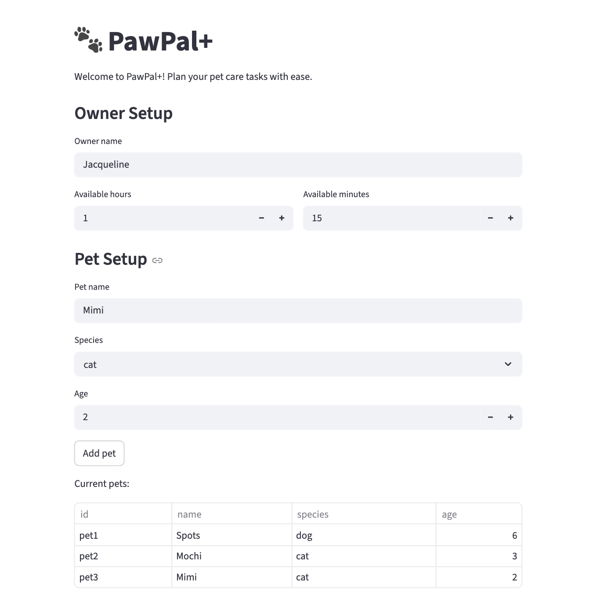
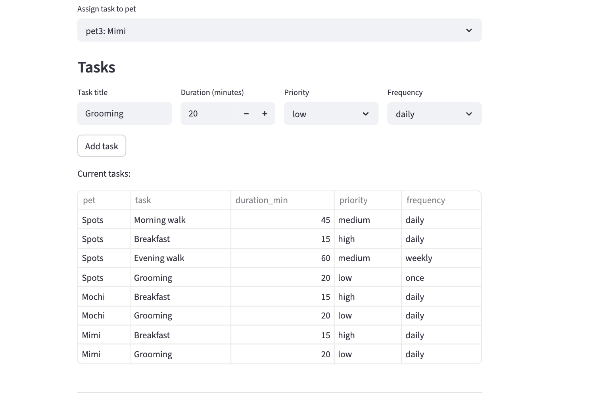
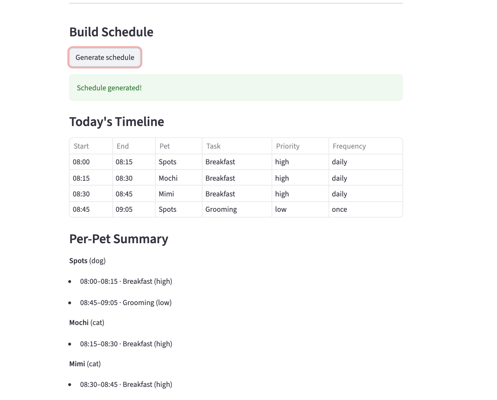
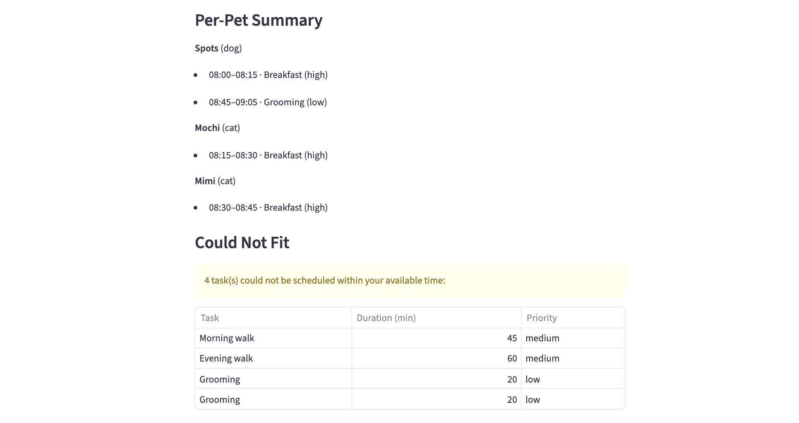

# PawPal+ (Module 2 Project)

You are building **PawPal+**, a Streamlit app that helps a pet owner plan care tasks for their pet.

## Scenario

A busy pet owner needs help staying consistent with pet care. They want an assistant that can:

- Track pet care tasks (walks, feeding, meds, enrichment, grooming, etc.)
- Consider constraints (time available, priority, owner preferences)
- Produce a daily plan and explain why it chose that plan

Your job is to design the system first (UML), then implement the logic in Python, then connect it to the Streamlit UI.

## What you will build

Your final app should:

- Let a user enter basic owner + pet info
- Let a user add/edit tasks (duration + priority at minimum)
- Generate a daily schedule/plan based on constraints and priorities
- Display the plan clearly (and ideally explain the reasoning)
- Include tests for the most important scheduling behaviors

## Features

- **Pet & Owner Management** — Add multiple pets with name, species, and age. Set your daily available time in hours and minutes.
- **Task Scheduling** — Add tasks with a title, duration, priority (low/medium/high), and frequency (daily/weekly/once). Tasks are automatically assigned to the selected pet.
- **Priority-Based Planning** — The scheduler sorts tasks by priority (high first) and fits as many as possible within your available time budget.
- **Sorting by Time** — The generated schedule is displayed in chronological order using `sort_by_time()`.
- **Task Filtering** — Filter tasks by pet or completion status (pending/complete) using `filter_tasks()`.
- **Daily Recurrence** — Daily and weekly tasks are automatically re-queued after completion. One-time tasks (`once`) are never repeated.
- **Conflict Warnings** — If two tasks overlap in time, the app surfaces a visible warning using `warn_conflicts()` rather than crashing.
- **Overflow Handling** — Tasks that don't fit within your available time are listed separately in a "Could Not Fit" section.

## Demo

### Owner & Pet Setup


### Tasks Section


### Build Schedule


### Per-Pet Summary & Overflow



## Smarter Scheduling

Phase 4 added algorithmic intelligence to the scheduler. The following features are implemented in `pawpal_system.py` and verified by tests in `test_pawpal_system.py`:

- **Sort by time** — `Scheduler.sort_by_time()` returns scheduled entries ordered by start time, useful for displaying a clean timeline view.
- **Filter tasks** — `Owner.filter_tasks(pet_id, status)` returns tasks narrowed by pet and/or completion status (`"pending"` or `"complete"`). Filters can be combined.
- **Recurring task gating** — `Task.is_due(today)` checks a task's `frequency` (`daily`, `weekly`, `once`) against its `last_scheduled` date before it enters the schedule. When a recurring task is completed via `Scheduler.complete_task()`, the next occurrence is automatically queued on the pet.
- **Conflict detection** — `Scheduler.detect_conflicts()` scans all scheduled entries for overlapping time windows. `Scheduler.warn_conflicts()` returns the same results as human-readable warning strings without crashing the program.

## Testing PawPal+

Run the full test suite with:

```bash
python -m pytest test_pawpal_system.py -v
```

The suite contains 46 tests covering:

- **Task validation** — invalid duration, priority, and frequency values raise errors
- **Pet management** — add, remove, edit tasks; filter by priority and status
- **Owner aggregation** — get all tasks across pets, calculate total time needed
- **Scheduler** — daily plan generation, priority ordering, overflow handling
- **Sorting** — `sort_by_time` returns entries in chronological order
- **Filtering** — `filter_tasks` by pet, status, or both combined
- **Recurrence gating** — `is_due` correctly gates daily, weekly, and once tasks; `complete_task` queues next occurrence automatically
- **Conflict detection** — overlapping and same-start-time entries are flagged; adjacent entries are not
- **Edge cases** — pet with no tasks, owner with no pets, all tasks exceeding available time, no duplicate occurrences on schedule re-run

**Confidence level: ⭐⭐⭐⭐ (4/5)**
The core scheduling logic and edge cases are well covered. A fifth star would require testing the Streamlit UI interactions and per-day availability (a planned future feature).

## Getting started

### Setup

```bash
python -m venv .venv
source .venv/bin/activate  # Windows: .venv\Scripts\activate
pip install -r requirements.txt
```

### Suggested workflow

1. Read the scenario carefully and identify requirements and edge cases.
2. Draft a UML diagram (classes, attributes, methods, relationships).
3. Convert UML into Python class stubs (no logic yet).
4. Implement scheduling logic in small increments.
5. Add tests to verify key behaviors.
6. Connect your logic to the Streamlit UI in `app.py`.
7. Refine UML so it matches what you actually built.
