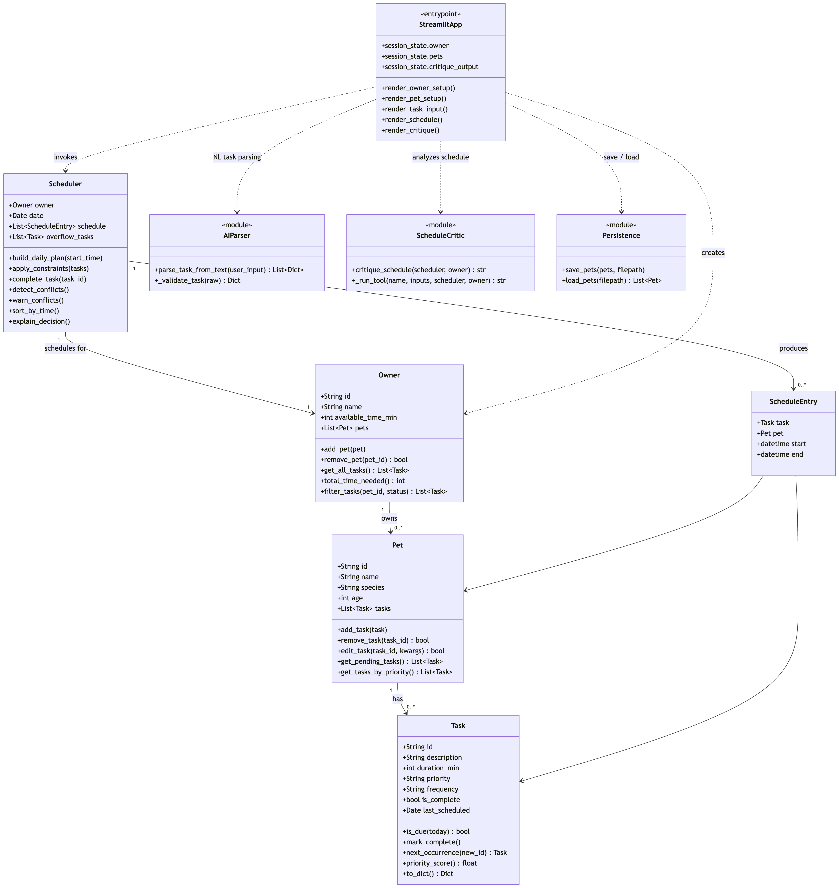
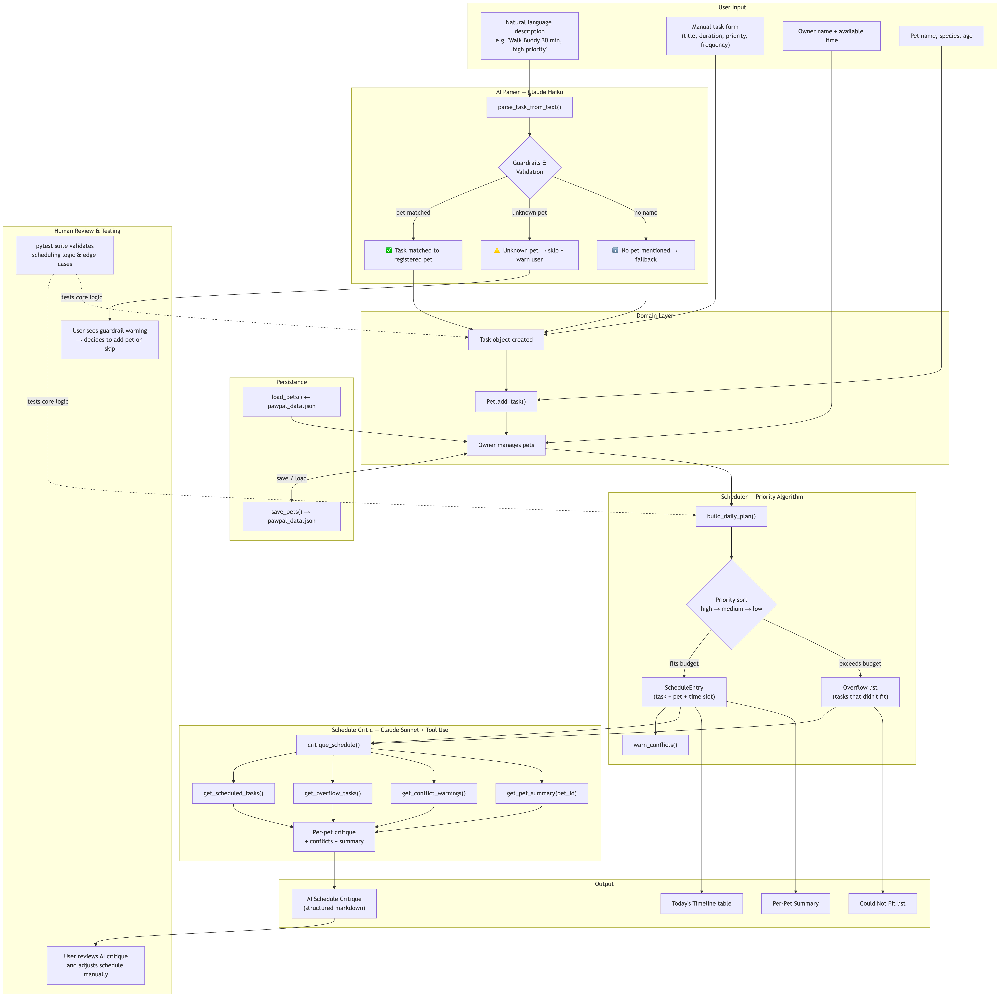

# PawPal+ Applied AI System

PawPal+ is a pet care scheduling assistant that combines a priority-based scheduling engine with Claude-powered AI features. It helps pet owners plan daily care tasks across multiple pets, parse tasks from natural language, and receive an intelligent critique of their schedule.

---

## Base Project

This system extends the **Module 2 PawPal+ project**, which established the core scheduling logic:

- `Task`, `Pet`, `Owner`, `Scheduler`, and `ScheduleEntry` classes
- Priority-based daily plan generation (high → medium → low)
- Recurring task gating (`daily`, `weekly`, `once`)
- Conflict detection and overflow handling
- A Streamlit UI and JSON persistence layer

The applied AI system builds on top of this foundation by adding natural language task input, AI-powered guardrails, and an agentic schedule critic.

---

## New AI Features

### 1. Natural Language Task Parser (`ai_parser.py`)
Uses **Claude Haiku** to convert plain English descriptions into structured task objects. Supports single and multi-task inputs in one prompt.

**Guardrails built in:**
- Validates all fields before creating a `Task` — bad duration defaults to 15 min, invalid priority defaults to `"medium"`
- Extracts the pet name mentioned in the text; Python matches it against the registered pet list
- Skips and warns the user if a mentioned pet is not registered
- Falls back to the selected dropdown pet if no name is mentioned

### 2. Agentic Schedule Critic (`schedule_critic.py`)
Uses **Claude Sonnet** with tool use to analyze the generated schedule and produce a structured, per-pet critique. Claude actively calls tools to gather data before writing its response — this is a multi-step agentic workflow, not a single prompt.

**Tools available to the agent:**
- `get_scheduled_tasks()` — what fit in today's plan
- `get_overflow_tasks()` — what got cut
- `get_conflict_warnings()` — any overlapping tasks
- `get_pet_summary(pet_id)` — per-pet breakdown

**Output format:** per-pet sections with observations, a conflicts block, and a plain-language summary.

---

## System Architecture

### Class Diagram
Shows all major classes, their attributes/methods, and relationships.



### Data Flow Diagram
Shows how data moves through the system — from user input through the AI parser, scheduler, and critic agent to final output. Includes where human review and testing are involved.



---

## Guardrails — Sample Behavior

The guardrail system in `ai_parser.py` handles three cases:

**Case 1 — Registered pet recognized:**
```
Input:  "Walk Buddy for 30 minutes every morning, high priority."
Output: ✅ Added to Buddy: 'morning walk' — 30 min, high, daily
```

**Case 2 — Unregistered pet detected (skip + warn):**
```
Input:  "Give Luna her weekly bath, about 20 minutes."
Output: ⚠️ 'Luna' isn't in your pet list — skipped 'bath'.
        Add Luna in Pet Setup first.
```

**Case 3 — No pet mentioned (fallback):**
```
Input:  "Give a quick brushing session, 10 minutes."
Output: ℹ️ No pet mentioned — 'brushing session' needs manual assignment.
```

**Field validation:**
```
Invalid duration  → defaults to 15 min
Invalid priority  → defaults to "medium"
Invalid frequency → defaults to "daily"
Empty description → task is rejected entirely
```

---

## Setup

### Requirements
- Python 3.11+
- An Anthropic API key

### Install
```bash
python -m venv .venv
source .venv/bin/activate   # Windows: .venv\Scripts\activate
pip install -r requirements.txt
```

### API Key
Create a `.env` file in the project root:
```
ANTHROPIC_API_KEY=your_key_here
```

---

## Running the Demo

The demo script mirrors the full Streamlit app workflow in the terminal:

```bash
python main.py
```

**What it demonstrates:**
- Step 1 — Owner setup
- Step 2 — Pet setup
- Step 3 — Manual task entry
- Step 4 — AI parser with 5 example inputs (including guardrail cases)
- Step 5 — Priority-based schedule generation
- Step 6 — Recurrence gating and task filtering
- Step 7 — Agentic schedule critique with tool use

## Running the Streamlit App

```bash
streamlit run app.py
```

---

## Running the Tests

```bash
python -m pytest test_pawpal_system.py -v
```

The suite contains 46 tests covering:

- Task validation — invalid duration, priority, and frequency raise errors
- Pet management — add, remove, edit tasks
- Owner aggregation — total time, cross-pet task retrieval
- Scheduler — priority ordering, overflow handling, daily plan generation
- Sorting — `sort_by_time` returns entries in chronological order
- Filtering — `filter_tasks` by pet, status, or both
- Recurrence — `is_due` gates correctly; `complete_task` queues next occurrence
- Conflict detection — overlapping entries flagged; adjacent entries are not
- Edge cases — no tasks, all tasks overflow, no duplicate scheduling

---

## File Structure

```
pawpal_system.py      — Core domain classes (Task, Pet, Owner, Scheduler)
ai_parser.py          — Claude Haiku natural language task parser + guardrails
schedule_critic.py    — Claude Sonnet agentic schedule critic (tool use)
persistence.py        — JSON save/load for pets and tasks
app.py                — Streamlit UI
main.py               — End-to-end CLI demo
test_pawpal_system.py — 46-test pytest suite
UML/                  — Architecture diagrams (class + data flow)
```

---

## Model Comparison

| Feature | Model | Why |
|---|---|---|
| Task parsing | Claude Haiku | Fast, cheap, structured extraction |
| Schedule critique | Claude Sonnet | Better multi-step reasoning and nuanced feedback |

Haiku handles the structured parsing job well — it only needs to extract a few fields from a sentence. Sonnet is used for the critic because it reasons more carefully across multiple tool results before writing a response.
