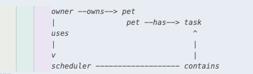

# PawPal+ Project Reflection

## 1. System Design

**a. Initial design**

- Briefly describe your initial UML design.

    I first began with relationship between the entities i identified from the list: Task, Owner, Pet, and Scheduler. I noticed a system:

    

- What classes did you include, and what responsibilities did you assign to each?

    Classes I included were, Task, Pet, Owner, ScheduleEntry, and Scheduler

    Task:
    
    + make id
    + generate a description
    + give approx duration time
    + determine priority
    + how frequent the task should be done
    + assign completion status

    Pet:

    + make id for pet
    + receive name
    + species type
    + age
    + tasks (* instance of class above)
    + preferences
    + ability to assign more tasks
    + ability to remove tasks
    + edit tasks
    + tasks still pending
    + list tasks by priority

    Owner:

    + has an id
    + name
    + availability time (min)
    + add pets (>=1)
    + remove pets
    + retrieve all tasks
    + total time needed to perform all pending tasks

    Scheduler:

    + has an owner
    + display date
    + list schedule
    + ability to build daily plan
    + explain decisions

**b. Design changes**

- Did your design change during implementation?

    Yes

- If yes, describe at least one change and why you made it.

    Initially, the Scheduler handled both planning logic and storing scheduled task details. This made it responsible for too much, so I have implemented ScheduleEntry class

    ScheduleEntry:
    
    + Tasks (* instance from the class Task)
    + Pet (* instance from Pet class)
    + start date & time
    + end date & time

    I introduced this class to improve separation of concerns and better encapsulate scheduling data.

    separated concerns:

    * Scheduler focuses on creating the schedule (logic)

    * ScheduleEntry represents individual scheduled items (data)

    This improves modularity and makes the design easier to extend and maintain. In other words, I abstracted the concept of a “scheduled task” into its own class instead of overloading the Scheduler.

---

## 2. Scheduling Logic and Tradeoffs

**a. Constraints and priorities**

- What constraints does your scheduler consider (for example: time, priority, preferences)?
- How did you decide which constraints mattered most?

    The scheduler considers three main constraints: available time (the owner's daily time budget in minutes), task priority (high/medium/low), and recurrence (daily/weekly/once via `is_due()`).

    Priority felt like the most important one to get right first — if you only have 30 minutes and have both a vet appointment and a playtime session, the vet should always win. Time budget came second because no matter how important a task is, if it physically doesn't fit, it can't run. Recurrence came last in the build order but ended up being one of the more interesting ones to implement, since it required tracking state across runs.

**b. Tradeoffs**

- Describe one tradeoff your scheduler makes.
- Why is that tradeoff reasonable for this scenario?

**Tradeoff: O(n²) pairwise conflict detection vs. a sorted interval sweep**

The detect_conflicts method checks every pair of entries for overlaps, which makes it O(n²) (e.g., 10 tasks → 45 comparisons, 100 → 4,950). A more efficient approach would be to sort by start time and only compare adjacent entries (O(n log n)).

That said, the tradeoff is fine here. A typical pet owner will only have around 10–20 tasks, so the performance difference is negligible. The nested loop is also easier to read and reason about, so prioritizing simplicity over optimization makes sense.

---

## 3. AI Collaboration

**a. How you used AI**

- How did you use AI tools during this project (for example: design brainstorming, debugging, refactoring)?
- What kinds of prompts or questions were most helpful?

    I used AI tools sparingly and mainly as a support resource when I needed a second perspective. Most of my work—like designing the overall class structure and implementing core functionality—was done independently. Where AI was most helpful was in refining specific pieces, such as thinking through edge cases I might have overlooked (for example, handling situations where a pet has no tasks or when all tasks exceed the available time). I also occasionally used it to sanity-check my approach or compare alternative implementations, especially when deciding between different ways to structure logic.

    The most useful prompts were the ones where I included context about my goal and constraints, rather than just asking for direct solutions. For instance, instead of asking for a function outright, I would ask about different approaches to solving a problem and the tradeoffs between them. That helped me better understand why one approach might be preferable over another, and then I could adapt that reasoning into my own implementation.

**b. Judgment and verification**

- Describe one moment where you did not accept an AI suggestion as-is.
- How did you evaluate or verify what the AI suggested?

    One moment was when AI suggested replacing the nested loop in detect_conflicts with an itertools.combinations version shorter, more "Pythonic." I looked at both, ran the tests to confirm they produced the same results, and decided to keep the original. The nested loop makes the pairwise comparison obvious just by reading it, and since this app isn't handling hundreds of tasks, there was no real performance reason to trade readability for cleverness. That felt like my call to make, not AI's.

**c. Pet Name Matching — Knowing When Not to Use AI**

    During testing I noticed the parser was inconsistently attributing tasks to pets — returning null for registered pets like Rocky even when the name was clearly in the input. The design was already broken into steps, but the issue was that pet name extraction and list matching were both happening inside the same model call, and Haiku wasn't reliable enough for the matching part.

    The fix was an architectural one: Claude stays responsible for reading the natural language and extracting the name as written, and I did the matching against the registered pet list. That's a loop, not a language problem. Once I separated the two responsibilities the behavior became consistent and predictable.

    What I took away is that testing reveals where AI is actually reliable in your pipeline versus where it's just adding noise. The programmer still has to be the one to notice that distinction and reorganize accordingly — Claude won't flag its own inconsistencies.

---

## 4. Testing and Verification

**a. What you tested**

- What behaviors did you test?
- Why were these tests important?

**b. Confidence**

- How confident are you that your scheduler works correctly?

    4/5. The backend logic is well covered. 
    
- What edge cases would you test next if you had more time?

    What I'd test next with more time is the Streamlit UI interactions and per-day availability, which is a feature I plan to add after this submission.
---

## 5. Reflection

**a. What went well**

- What part of this project are you most satisfied with?

    The backend ended up being cleaner than I expected. The separation between Scheduler (logic) and ScheduleEntry (data) made everything easier to extend as new features came in.

**b. What you would improve**

- If you had another iteration, what would you improve or redesign?

    I'd add per-day availability — right now the owner gets one flat time budget for every day, which isn't realistic. Monday and Saturday look very different for most people.

**c. Key takeaway**

- What is one important thing you learned about designing systems or working with AI on this project?

    AI is a fast collaborator but a bad architect. It'll give you working code quickly, but if you don't understand the design, you end up with a system you can't explain or extend. The most useful thing I learned is that the clearer your question, the better the answer — and you still have to be the one deciding what's right.